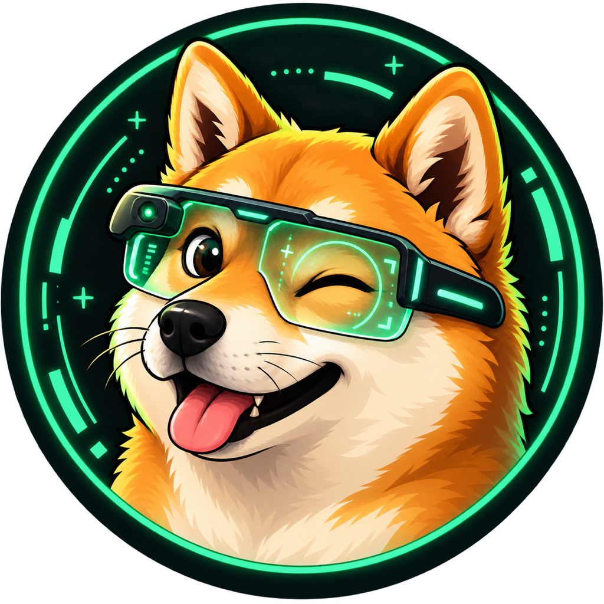

<p align="center">
  
</p>

<h1 align="center">Doge</h1>

<p align="center">An X reader for Even G2. Your timeline, a glance away.</p>

<p align="center">
  <a href="#quick-start">Quick start</a> ·
  <a href="docs/reader-guide.md">Reader guide</a> ·
  <a href="docs/development.md">Development</a> ·
  <a href="docs/deployment.md">Deployment</a>
</p>

---

Doge brings Home, Following, Bookmarks, threads and profiles to the Even G2's
576 × 288 display. Read full posts, browse images and manage reactions with the
glasses' touch controls. An iPhone companion handles gateway pairing.

For use on the glasses, you need an Even G2 paired with an Even Hub-compatible
Even App on your iPhone. You can try the reader locally in the simulator without
glasses or an X account.

Live data comes from your own signed-in X browser session through a self-hosted
gateway. No X API key is required. The Mac running the gateway and browser must
remain online while you read.

## Features

- **Three feeds, one reader.** Switch between Home, Following and Bookmarks;
  open a thread or an author's profile from any post.
- **Full text.** Read long posts with firmware-native scrolling. Longer text is
  split into bounded chunks without truncation.
- **Images in context.** View up to four images alongside a post or open the
  gallery for a larger view. Videos and animated GIFs appear as still posters.
- **Reactions on the glasses.** Like, repost and bookmark, or undo each action.
- **Your own gateway.** Pair an HTTPS gateway and access key on your device.
  Public packages contain no preset server or maintainer credentials.
- **Local development.** Explore the reader with deterministic mock data before
  connecting an X account.

> [!NOTE]
> Physical-device validation is tracked in [Backlog.md](Backlog.md), including
> background recovery, phone locking and use away from home. A successful build
> or simulator run does not establish those behaviours.

## Quick start

This path runs the source checkout with mock data in the Even Hub simulator on
**macOS**. You need Git, **Node.js 24.15.0** (see [`.node-version`](.node-version))
and **npm 11.12.1** (pinned in [`package.json`](package.json)). `npm ci` installs
the simulator alongside the app's other development dependencies. Ports 8787
and 5173 must be available.

Clone the repository and install its dependencies:

```sh
git clone https://github.com/hauntedfail/Doge.git
cd Doge
npm ci
```

Once installation succeeds, create a temporary development key and start the
mock gateway and companion in the same terminal:

```sh
export GATEWAY_BEARER_TOKEN="$(
  node -p 'require("node:crypto").randomBytes(32).toString("base64url")'
)"
printf '%s' "$GATEWAY_BEARER_TOKEN" | pbcopy
X_SOURCE=mock npm run dev
```

This starts the mock gateway at `http://127.0.0.1:8787` and the companion at
`http://127.0.0.1:5173`. Keep this terminal running. The `pbcopy` command puts the
key on the macOS clipboard without printing it. Keep it private; it is not an
X API key.

In a second terminal, change to the same `Doge` directory and launch the installed
simulator:

```sh
npx --no-install evenhub-simulator http://127.0.0.1:5173
```

In the simulator's companion window:

1. Open **Gateway settings**, enter `http://127.0.0.1:8787` and paste the key.
2. Select **Save and test connection**. The confirmation should read
   **Connected to http://127.0.0.1:8787. Settings were saved.**
3. Select **Home** using the companion's test controls or the simulator's glasses
   controls. The first post should read:

   > Doge is running in mock mode with deterministic timeline data.

A regular browser can show the companion layout, but it cannot complete pairing:
settings wait for the Even SDK bridge supplied by the simulator or Even App.
If **Save and test connection** stays disabled, check that you opened the URL in
the simulator.

To stop, quit the simulator and press `Ctrl-C` in the development terminal.
Restarting from the same shell retains the development key; if you generate a
new key, update the companion pairing.

Loopback addresses work only on the machine running Doge. For an iPhone and
physical glasses, use the [authenticated preview](docs/development.md#live-device-preview)
or a [deployed gateway](docs/deployment.md).

## How it works

```text
Even G2 + iPhone companion
           │ HTTPS + bearer authentication
           ▼
      Doge gateway :8787
           │ Allowlisted operations over loopback
           ▼
      Safe Relay :6900
           │
           ▼
   Dedicated X browser session
```

[`twitter_api_safe_relay`](https://github.com/fa0311/twitter_api_safe_relay)
uses the signed-in browser session. Doge validates and normalises the results
into a shared wire contract before sending them to the glasses. Timeline entries
marked by X with `promotedMetadata` are removed before normalisation.

> [!IMPORTANT]
> Keep Safe Relay on loopback. Expose only the bearer-authenticated Doge gateway
> through a tunnel. Supported write actions are limited to enabling and removing
> likes, reposts and bookmarks. See the [security model](docs/security.md).

## Documentation

| Guide                                        | Contents                                                  |
| -------------------------------------------- | --------------------------------------------------------- |
| [Reader guide](docs/reader-guide.md)         | Controls, text, images and saved pairing                  |
| [Development](docs/development.md)           | Local setup, live X data, preview and verification        |
| [Deployment](docs/deployment.md)             | HTTPS hosting, production operation and Even Hub packages |
| [Gateway protocol](docs/gateway-protocol.md) | Pairing handshake, routes and compatibility               |
| [Security](docs/security.md)                 | Authentication, relay restrictions and data handling      |
| [Documentation index](docs/INDEX.md)         | Architecture sources and documentation ownership          |

## Contributing

Start with [`AGENTS.md`](AGENTS.md) and the [documentation index](docs/INDEX.md).
Use the nearest package's instructions when changing the G2 app or gateway.
Write documentation in British English and add regression coverage for behaviour
changes.

For a concrete place to help, see the outstanding device checks in
[`Backlog.md`](Backlog.md). When reporting a device issue, include the app version,
Even App version, reproduction steps and whether it occurs in the simulator or
on physical glasses. Keep access keys and X session data out of reports.

```sh
npm run verify          # Formatting, repository checks, types, tests and builds
npm run verify:release  # Also package and check the production EHPK
```

The same release verification runs in CI. See [development](docs/development.md#verification)
for focused commands and [agent harness design](docs/agent-harness.md) for the
repository's approach to coding agents.

| Path                                       | Responsibility                                                   |
| ------------------------------------------ | ---------------------------------------------------------------- |
| [`apps/g2`](apps/g2)                       | Even Hub app, glasses display and iPhone companion               |
| [`apps/gateway`](apps/gateway)             | Hono/Node.js gateway, X response normalisation and image proxies |
| [`packages/contracts`](packages/contracts) | Shared Zod request and response schemas                          |
| [`scripts`](scripts)                       | Relay setup, preview, production operation and repository checks |

## Licence

[GNU Affero General Public License v3.0 only](LICENSE).
The Doge illustration is an original project asset; see its
[asset licence](apps/g2/public/doge-icon.LICENSE.md).
